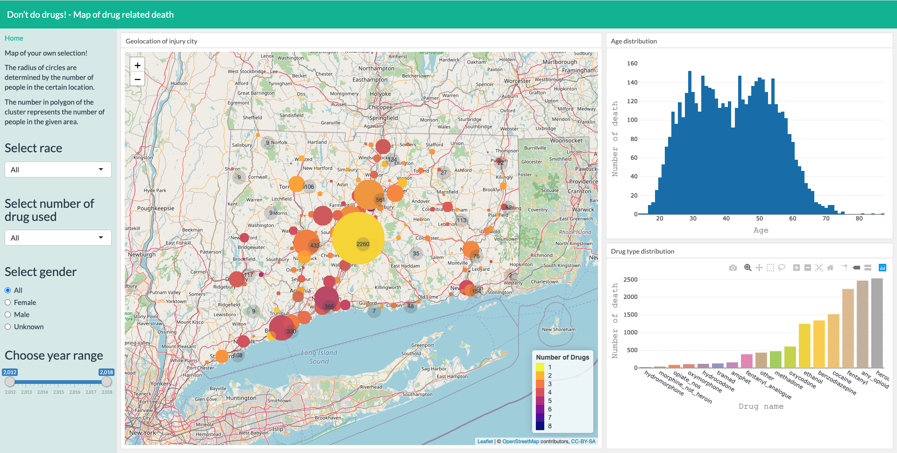
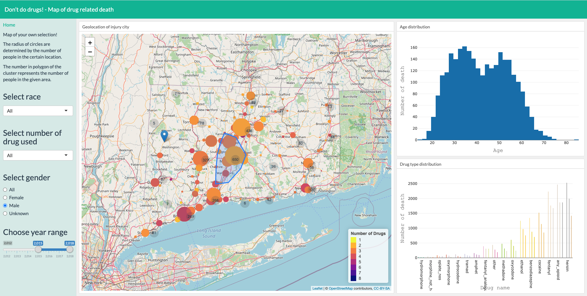
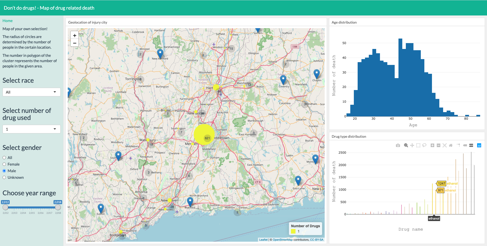

```{r setup, include=FALSE}
knitr::opts_chunk$set(echo = TRUE)
```

The R Shiny cloud deloyment is too slow sometimes so I put some screenshots below. You could also access the original page by going to https://wq4rstudio.shinyapps.io/shiny_template/. The map is interactive with multiple toolboxes to visualize different tranche of data. 


{}

{}

{}